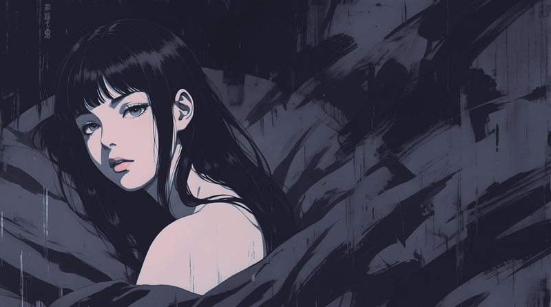
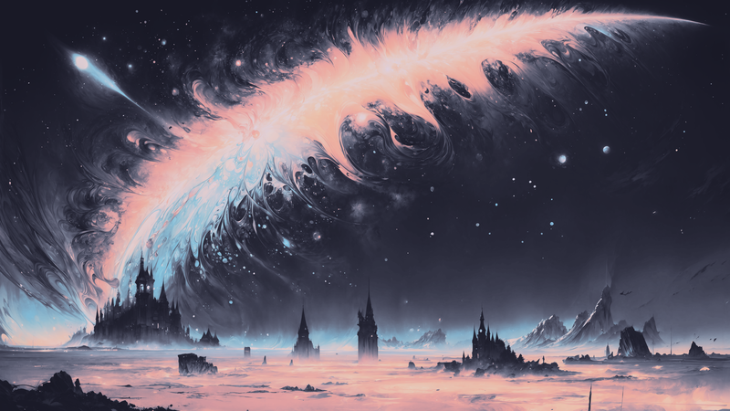

# 🌿 wallppuccin

A curated collection of wallpapers converted to the **Catppuccin Mocha** color palette.

## 🌌 Why Mocha?
Mocha is the darkest flavor of Catppuccin Mocha, designed for a cozy, high-contrast yet soft aesthetic. This repository aims to be the go-to place for Mocha lovers.

### 🖼️ Wallpapers Gallery (Mocha)

| | | |
| :---: | :---: | :---: |
|  |  |  |
|  |  |  |
|  |  |  |

## 🛠️ Conversion Details
All images are processed to match the Catppuccin Mocha Palette hex codes:
| Preview | Color Name | Hex |
| :---: | :--- | :--- |
|  | **Rosewater** | `#F5E0DC` |
|  | **Flamingo** | `#F2CDCD` |
|  | **Pink** | `#F5C2E7` |
|  | **Mauve** | `#CBA6F7` |
|  | **Red** | `#F38BA8` |
|  | **Peach** | `#FAB387` |
|  | **Yellow** | `#F9E2AF` |
|  | **Green** | `#A6E3A1` |
|  | **Teal** | `#94E2D5` |
|  | **Sky** | `#89DCEB` |
|  | **Blue** | `#89B4FA` |
|  | **Lavender** | `#B4BEFE` |
|  | **Text** | `#CDD6F4` |
|  | **Base** | `#1E1E2E` |
|  | **Mantle** | `#181825` |
|  | **Crust** | `#11111B` |

## 🔗 Credits
- Colors by [Catppuccin](https://github.com/catppuccin/catppuccin).
- Original images from [Wallhaven](https://wallhaven.cc).
